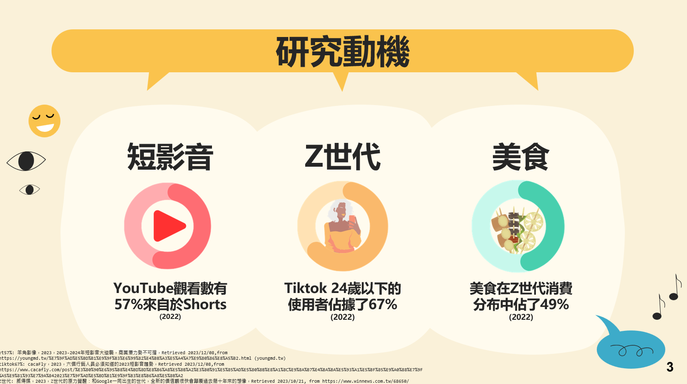

# DEMO連結: https://youtu.be/UsGZcs2lUaQ    
     
# 摘要    
近年來，隨著「注意力破碎化」的趨勢，短影音變成主流的娛樂模式，靠節奏快速、內容精煉的短影音，即便是很破碎的使用時間，仍然足以吸收大量的訊息。    
而短影音熱門主題中，又以「美食」為榜首，顯示大眾對美食主題的接受度和需求之高。     
本產品FEASTARS的核心目標是想藉由美食短影音平台打造一個聚焦於美食主題的社群環境，讓使用者透過短影音的方式探索、分享和互動。    
平台提供了簡單易用的創作工具，讓用戶能輕鬆拍攝、分享與美食相關的短影音內容。影音創作者可收到愛心、追蹤和評論，建立個人追蹤者基礎，同時提升餐廳曝光度。      
除此之外，為了更加貼合「美食」此主題，此專題將設計出一套演算法，除了讓平台推薦的短影音更加貼近使用者用餐喜好外，也將開發用餐推薦系統，透過GPS定位、用戶瀏覽短影音時的使用習慣、收藏的餐廳和預算考量等因素，為用戶提供下一餐吃什麼的建議。   
在經營方面，FEASTARS採用Web2.0的概念，讓用戶作為主要內容的提供者。此外，管理者透過分析用戶上傳的影片資訊，可以了解大眾最新的美食趨勢，或是不同客群的食物偏好、以及價格與消費人數的關係等資訊，從中創造價值。     
總結來說，這個平台旨在讓使用者輕鬆探索到理想餐廳，享受個人化的推薦，並共同促進美食社群的發展。   
 
## 關鍵字:美食、短影音創作、用餐推薦、Web2.0  

# 研究動機  

近年來,隨著注意力的高度分散,短影音已成為各大影音平台的主流內容形式。  
以YouTube為例,目前超過一半的觀看量都來自於Shorts這個短影音功能，   
而主要推手,正是所謂的Z世代年輕族群。  
據統計,24歲以下的用戶就佔了短影音霸主TikTok使用者比例的67%。   
有鑑於此,我們進一步分析了Z世代的消費結構,發現高達49%的支出都與美食相關。   
由此可見,結合短影音和美食主題,將可能開創新的商機。   

  

# 功能  
  

+ 演算法採用興趣分數表  

# 瀏覽系統播放機制
  
為了防止都只出現使用者喜歡的食物影片，導致內容單一化，我們會適度安插熱門影片。讓使用者也能開拓不同食物類型。    
最後，為了配合商業模式的運行，我們也會插入廣告，而這些廣告也會受到個人喜好演算法所影響，幫助廣告商精準投放到受眾眼前  
這些種類的影片會依照一定的比例組成，成為我們的瀏覽系統播放機制。    

# 地圖搜尋  

# 創作功能  
  

## 影像辨識  

我們採取的方法是將影片每5秒鐘產生一張截圖，再將所有截圖都辨識一次，  
並將結果儲存到一個陣列。最後在陣列中出現最多次的前兩名就會是本影片的辨識結果。  

## 個人頁面  

# 後台管理  
  

# 開發環境  
  

# 網路架構圖  
  

# 附錄  
  

